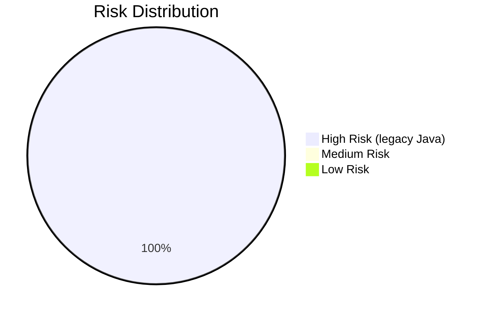
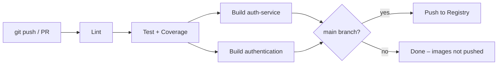

# Technical Debt Report – Natanael Security Platform

## Executive Summary

The ZCloud Security Platform is migrating from a monolithic Java-based application
to a Python microservices architecture. The primary goals are to enhance security,
scalability, and maintainability. The existing codebase consists of 47 classes with
key entities like `LoanApplication` and `Client`. Tight coupling and architectural
violations impede scalability and security enhancements. This document tracks
outstanding debt and the infrastructure decisions made to address it.

---

## Technical Debt Inventory

| # | Area | Description | Severity |
|---|------|-------------|----------|
| 1 | Architecture | Monolithic Java codebase; tightly coupled components | Critical |
| 2 | Security | Existing auth mechanisms insufficient for modern standards | Critical |
| 3 | Domain Boundaries | No explicit bounded contexts; unclear domain boundaries | High |
| 4 | Legacy Tech | Outdated Java + Maven stack | High |
| 5 | Integration | Complex coupling to database and email services | Medium |
| 6 | Dockerfiles | `loan-management` and `client-management` use placeholder images | Medium |
| 7 | CI/CD | Pipeline only covers `auth-service` and `authentication`; other services need adding | Low |

---

## Risk Matrix

|  | High Maintainability | Medium Maintainability | Low Maintainability |
|--|----------------------|------------------------|---------------------|
| **Critical** | 0 | 0 | 47 legacy Java files |
| **High** | 0 | 0 | 0 |
| **Medium** | 0 | 0 | 0 |

**High-Risk Files (legacy)**:
- `src/main/java/com/zcloud/platform/model/LoanApplication.java`
- `src/main/java/com/zcloud/platform/controller/AuthController.java`
- `src/main/java/com/zcloud/platform/util/JwtUtil.java`

---

## CI/CD Pipeline Setup

### Overview

The CI/CD pipeline automates build, test, security scan, and push of Docker images
for all containerised microservices. The canonical pipeline definition lives at:

```
.ci/docker-pipeline.yml
```

It is written as a **GitHub Actions** workflow. To activate it, copy the file to
`.github/workflows/docker-pipeline.yml` in the repository.

### Pipeline Stages

```
lint → test → build (parallel per service) → push (main only)
```

| Stage | Tool | Description |
|-------|------|-------------|
| **Lint** | flake8, mypy | Static analysis across `microservices/`, `services/`, `auth/` |
| **Test** | pytest | Full test suite with Redis service container; uploads JUnit XML + coverage |
| **Build** | docker/build-push-action | Builds each service image; runs `/health` smoke-test |
| **Push** | docker/login-action | Pushes tagged images to the registry (main branch only) |

### Services Covered

| Service | Dockerfile | Image name |
|---------|-----------|------------|
| `auth-service` | `microservices/auth_service/Dockerfile` | `<registry>/natanael/auth-service` |
| `authentication` | `services/authentication/Dockerfile` | `<registry>/natanael/authentication` |

> `loan-management` and `client-management` are currently placeholder services
> (no Dockerfile). Add them to the `matrix.service` list in `.ci/docker-pipeline.yml`
> once their Dockerfiles are created.

### Required Repository Secrets

Configure these in **GitHub → Settings → Secrets and variables → Actions**:

| Secret | Description |
|--------|-------------|
| `DOCKER_REGISTRY` | Container registry host (e.g. `ghcr.io` or AWS ECR endpoint) |
| `DOCKER_USERNAME` | Registry login username |
| `DOCKER_PASSWORD` | Registry password / Personal Access Token |
| `SECRET_KEY` | Flask secret key for integration test runs |
| `JWT_SECRET_KEY` | JWT signing secret for integration test runs |

### Image Tagging Strategy

Images pushed on `main` receive three tags:
1. **Git SHA** – `<short-sha>` – immutable, identifies the exact commit
2. **Branch** – `main` – mutable, always points to the latest successful build
3. **Semver** – `v1.2.3` – applied when a version tag is pushed (`v*.*.*`)
4. **latest** – mutable, always points to the most recent `main` build

### Retry & Failure Handling

- A failure in **lint** blocks **test**; a failure in **test** blocks **build**;
  a failure in **build** blocks **push**.
- The **build** stage runs services in parallel via a matrix; one service failing
  fails the entire job.
- Re-run the workflow from the GitHub Actions UI to retry all stages.
- The smoke-test step uses `--retry 3 --retry-delay 2` in curl to tolerate slow
  Gunicorn startup.

### Activating the Pipeline (Step-by-Step)

1. **Copy the pipeline file**:
   ```bash
   mkdir -p .github/workflows
   cp .ci/docker-pipeline.yml .github/workflows/docker-pipeline.yml
   ```

2. **Add repository secrets** (see table above).

3. **Push to `main` or open a PR** against `main`. GitHub Actions picks up the
   workflow automatically.

4. **Monitor** the run in **Actions** tab → *Docker Build, Test & Push*.

5. **Add new services** to the pipeline:
   - Create a `Dockerfile` for the service.
   - Add an entry to the `matrix.service` list in both the `build` and `push` jobs.

### Jenkins Alternative

An alternative Jenkins pipeline exists at `ci_cd/jenkins/Jenkinsfile`. It covers
the same lint → test → Docker build → ECR push → ECS deploy flow and is
parameterised by service and environment. See `scripts/deployment/build_scripts.sh`
for the underlying shell helpers.

---

## Prioritised Recommendations

1. **Security Platform Migration** – Migrate `AuthController`, `JwtUtil`, and
   `SecurityUtils` to Python microservices with JWT-based auth. *(In progress)*
2. **Decompose Monolith** – Break `LoanApplication` and `Client` into independent
   microservices. *(In progress)*
3. **Add Dockerfiles for placeholder services** – `loan-management` and
   `client-management` currently run from bare `python:3.12-slim` images. Each
   needs a proper `Dockerfile` before production deployment.
4. **Expand CI/CD matrix** – Once Dockerfiles are added, include all services in
   `.ci/docker-pipeline.yml`.
5. **Enhance Testability** – Refactor tightly coupled components; increase
   modularity and test isolation.
6. **Security Audits** – Perform thorough audits to identify and resolve existing
   vulnerabilities before production cutover.
7. **Manual Review** – All legacy Java files have a confidence score of 0.0 in
   the original analysis; conduct manual reviews for any migrated logic.

---

## Visualisations




